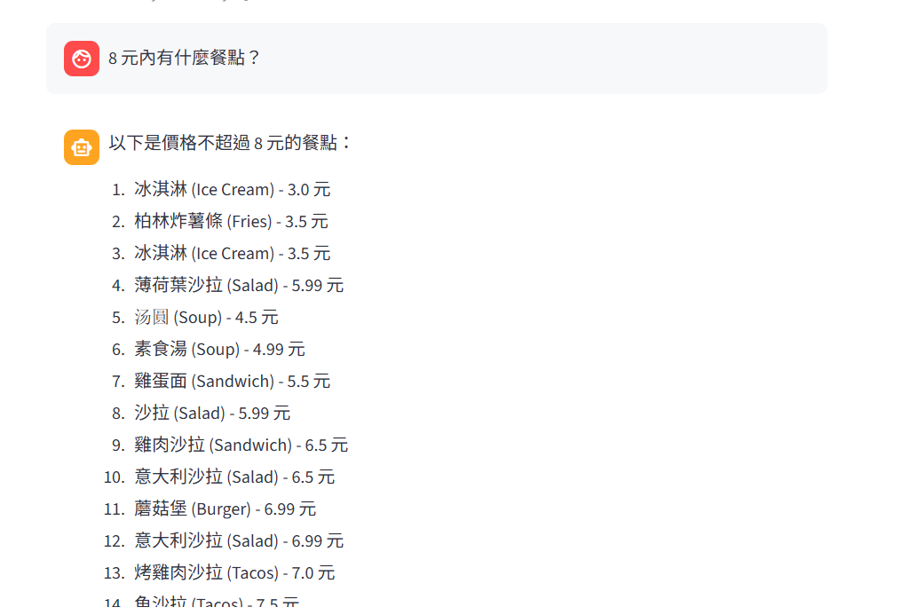
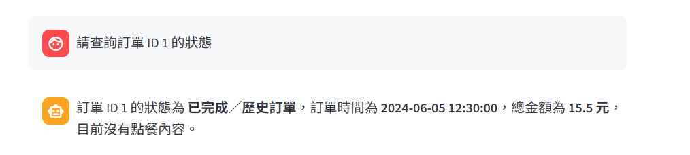
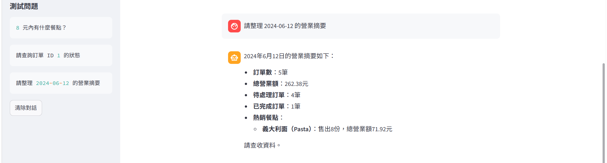

# Restaurant Operations AI Agent

## Overview

A local AI agent that answers restaurant menu, order, and sales questions using natural-language input.

## Features

- Query menu items within a budget
- Look up order status and order details
- Generate daily sales summaries
- Automatically select the appropriate tool
- Retrieve live data from MySQL
- Run locally without a paid cloud API

## Tech Stack

- Python
- Ollama
- Qwen3
- Streamlit
- MySQL
- mysql-connector-python

## Architecture

User
→ Streamlit
→ Ollama Agent
→ Python Function Tool
→ MySQL
→ Agent Response

## Available Tools

- `get_menu_items(max_price)`
- `get_order_status(order_id)`
- `get_daily_sales_summary(order_date)`

## Screenshots







## Installation

1. Install Python, Ollama and MySQL.
2. Download the model:

```bash
ollama pull qwen3:1.7b